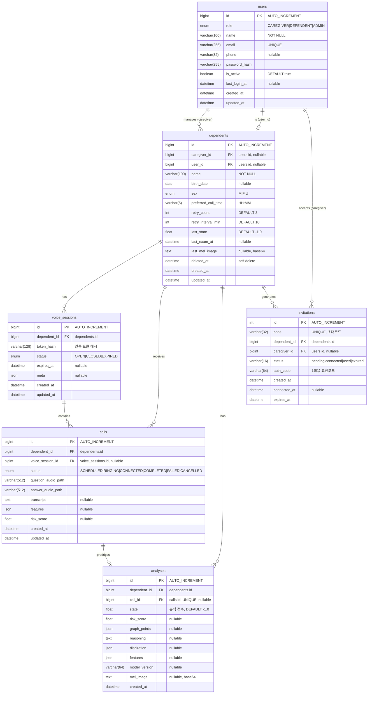

# HeartfeltCall ERD (Entity Relationship Diagram)

## 개요

HeartfeltCall 시스템의 데이터베이스 스키마를 정의합니다. MySQL 8.0+ 기반으로 설계되었습니다.

## ER 다이어그램



## 테이블 상세 설명

### 1. users (사용자)

시스템의 모든 사용자 정보를 저장합니다.

| 컬럼 | 타입 | 설명 |
|------|------|------|
| id | BIGINT | 기본키 |
| role | ENUM | 사용자 역할 (CAREGIVER: 보호자, DEPENDENT: 피보호자, ADMIN: 관리자) |
| name | VARCHAR(100) | 사용자 이름 |
| email | VARCHAR(255) | 이메일 (고유) |
| phone | VARCHAR(32) | 전화번호 |
| password_hash | VARCHAR(255) | 비밀번호 해시 (bcrypt) |
| is_active | BOOLEAN | 계정 활성화 상태 |
| last_login_at | DATETIME | 마지막 로그인 시간 |
| created_at | DATETIME | 생성 시간 |
| updated_at | DATETIME | 수정 시간 |

**인덱스:**
- `idx_users_role` - 역할별 조회
- `idx_users_email` - 이메일 조회

---

### 2. dependents (피보호자)

보호자가 관리하는 피보호자(노인) 프로필을 저장합니다.

| 컬럼 | 타입 | 설명 |
|------|------|------|
| id | BIGINT | 기본키 |
| caregiver_id | BIGINT | 보호자 FK (users.id) |
| user_id | BIGINT | 피보호자 본인 계정 FK (users.id, nullable) |
| name | VARCHAR(100) | 피보호자 이름 |
| birth_date | DATE | 생년월일 |
| sex | ENUM | 성별 (M: 남성, F: 여성, U: 미지정) |
| preferred_call_time | VARCHAR(5) | 선호 전화 시간 (HH:MM) |
| retry_count | INT | 통화 재시도 횟수 (기본값: 3) |
| retry_interval_min | INT | 재시도 간격(분) (기본값: 10) |
| last_state | FLOAT | 최근 분석 점수 (-1.0: 미분석) |
| last_exam_at | DATETIME | 마지막 검사 시간 |
| last_mel_image | TEXT | 최근 Mel 스펙트로그램 이미지 (base64) |
| deleted_at | DATETIME | 삭제 시간 (soft delete) |
| created_at | DATETIME | 생성 시간 |
| updated_at | DATETIME | 수정 시간 |

**인덱스:**
- `ix_dependents_caregiver_deleted` - 보호자별 활성 피보호자 조회

**관계:**
- `caregiver_id` → `users.id` (N:1, CASCADE)
- `user_id` → `users.id` (1:1, 선택적)

---

### 3. invitations (초대 코드)

피보호자-보호자 연결을 위한 초대 코드를 관리합니다.

| 컬럼 | 타입 | 설명 |
|------|------|------|
| id | INT | 기본키 |
| code | VARCHAR(32) | 초대 코드 (고유, 22자 base64url 권장) |
| dependent_id | BIGINT | 피보호자 FK |
| caregiver_id | BIGINT | 수락한 보호자 FK (nullable) |
| status | VARCHAR(16) | 상태 (pending/connected/used/expired) |
| auth_code | VARCHAR(64) | 1회용 토큰 교환 코드 |
| created_at | DATETIME | 생성 시간 |
| connected_at | DATETIME | 연결 시간 |
| expires_at | DATETIME | 만료 시간 |

**상태 흐름:**
```
pending → connected → used
                ↘ expired
```

---

### 4. voice_sessions (음성 세션)

피보호자의 음성 녹음 세션을 관리합니다.

| 컬럼 | 타입 | 설명 |
|------|------|------|
| id | BIGINT | 기본키 |
| dependent_id | BIGINT | 피보호자 FK |
| token_hash | VARCHAR(128) | 세션 토큰 해시 (SHA-256) |
| status | ENUM | 상태 (OPEN/CLOSED/EXPIRED) |
| expires_at | DATETIME | 만료 시간 |
| meta | JSON | 메타데이터 |
| created_at | DATETIME | 생성 시간 |
| updated_at | DATETIME | 수정 시간 |

---

### 5. calls (통화 기록)

음성 세션 내 개별 질문-응답 통화 기록을 저장합니다.

| 컬럼 | 타입 | 설명 |
|------|------|------|
| id | BIGINT | 기본키 |
| dependent_id | BIGINT | 피보호자 FK |
| voice_session_id | BIGINT | 음성 세션 FK (nullable) |
| status | ENUM | 통화 상태 |
| question_audio_path | VARCHAR(512) | 질문 오디오 파일 경로 |
| answer_audio_path | VARCHAR(512) | 응답 오디오 파일 경로 |
| transcript | TEXT | 음성 인식 텍스트 |
| features | JSON | 음성 특징 데이터 |
| risk_score | FLOAT | 위험 점수 |
| created_at | DATETIME | 생성 시간 |
| updated_at | DATETIME | 수정 시간 |

**통화 상태:**
- `SCHEDULED` - 예약됨
- `RINGING` - 호출 중
- `CONNECTED` - 연결됨
- `COMPLETED` - 완료
- `FAILED` - 실패
- `CANCELLED` - 취소됨

---

### 6. analyses (분석 결과)

AI 음성 분석 결과를 저장합니다.

| 컬럼 | 타입 | 설명 |
|------|------|------|
| id | BIGINT | 기본키 |
| dependent_id | BIGINT | 피보호자 FK |
| call_id | BIGINT | 통화 기록 FK (UNIQUE, nullable) |
| state | FLOAT | 분석 상태 점수 (-1.0: 미분석, 0~1: 위험도) |
| risk_score | FLOAT | 위험 점수 |
| graph_points | JSON | 그래프 데이터 |
| reasoning | TEXT | 분석 근거 |
| diarization | JSON | 화자 분리 데이터 |
| features | JSON | 추출된 음성 특징 |
| model_version | VARCHAR(64) | AI 모델 버전 |
| mel_image | TEXT | Mel 스펙트로그램 이미지 (base64) |
| created_at | DATETIME | 생성 시간 |

**분석 상태 해석:**
- `-1.0`: 미분석
- `0.0 ~ 0.3`: 정상 (NORMAL)
- `0.3 ~ 0.7`: 경도 인지장애 (MCI)
- `0.7 ~ 1.0`: 치매 의심 (DEMENTIA)

---

## 주요 관계 요약

| 관계 | 타입 | 설명 |
|------|------|------|
| users → dependents | 1:N | 보호자는 여러 피보호자를 관리 |
| dependents → voice_sessions | 1:N | 피보호자는 여러 음성 세션을 가짐 |
| dependents → calls | 1:N | 피보호자는 여러 통화 기록을 가짐 |
| dependents → analyses | 1:N | 피보호자는 여러 분석 결과를 가짐 |
| voice_sessions → calls | 1:N | 음성 세션은 여러 통화를 포함 |
| calls → analyses | 1:1 | 통화당 하나의 분석 결과 |
| dependents → invitations | 1:N | 피보호자는 여러 초대 코드 생성 가능 |
